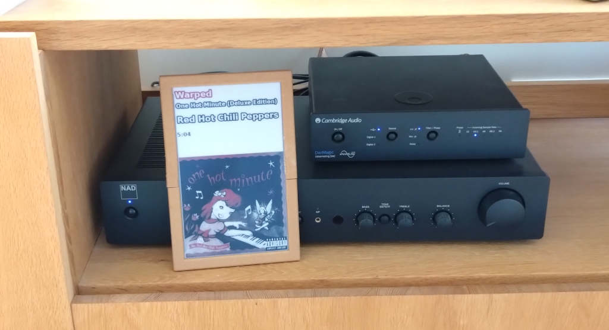
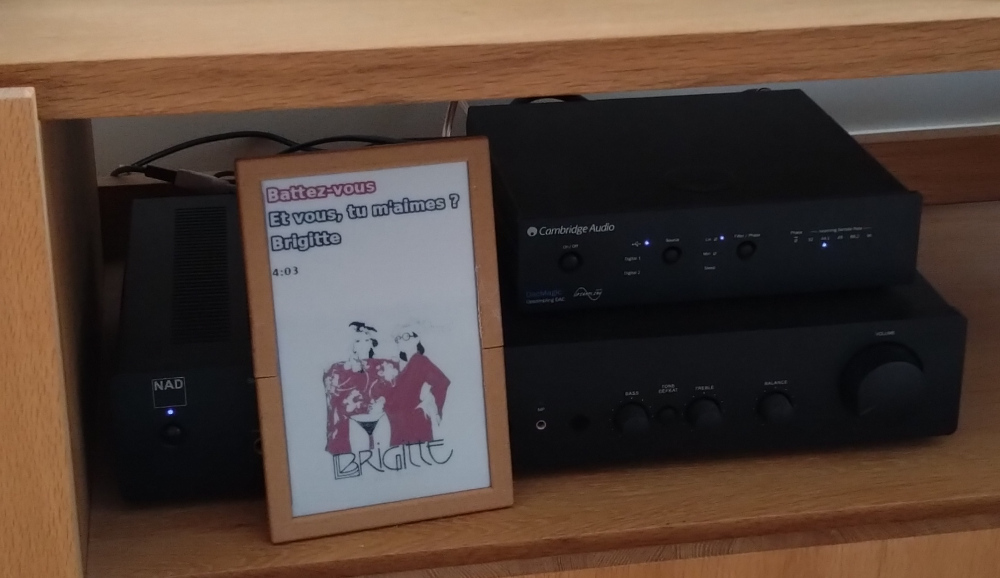
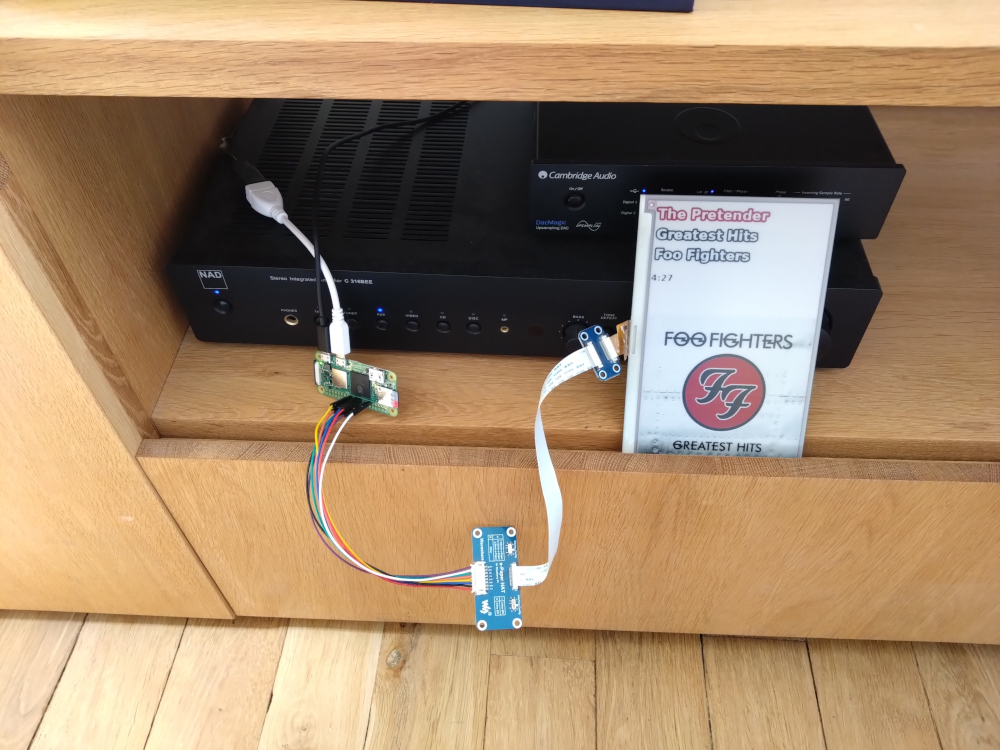

A very naive librespot event handler which displays now playing track information on a WaveShare EPD 7.5" red / black / white screen

Uses:
 * librespot: https://github.com/librespot-org/librespot/ (requires dev branch / version 5.0 events)
 * omni-epd: https://github.com/robweber/omni-epd/

