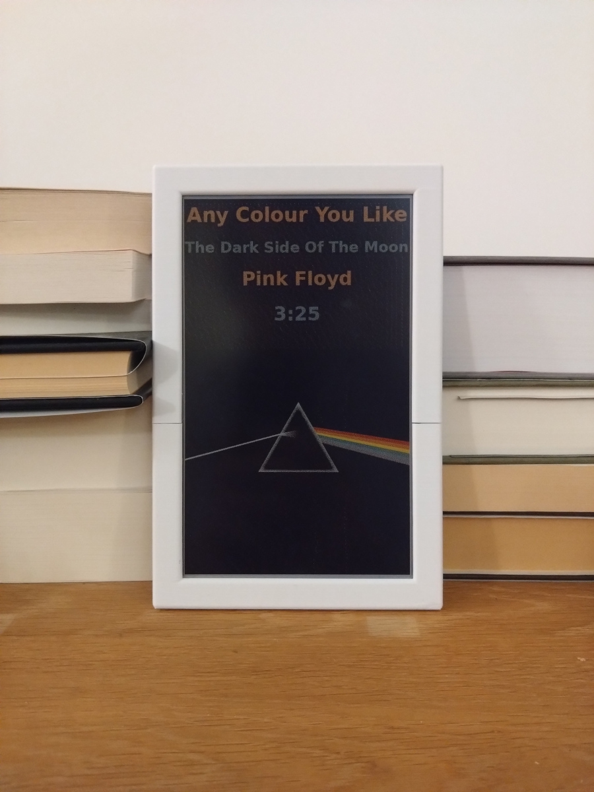
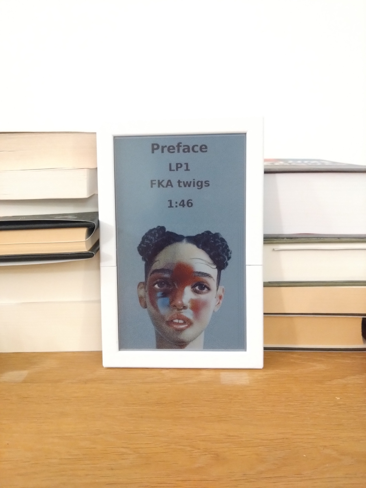
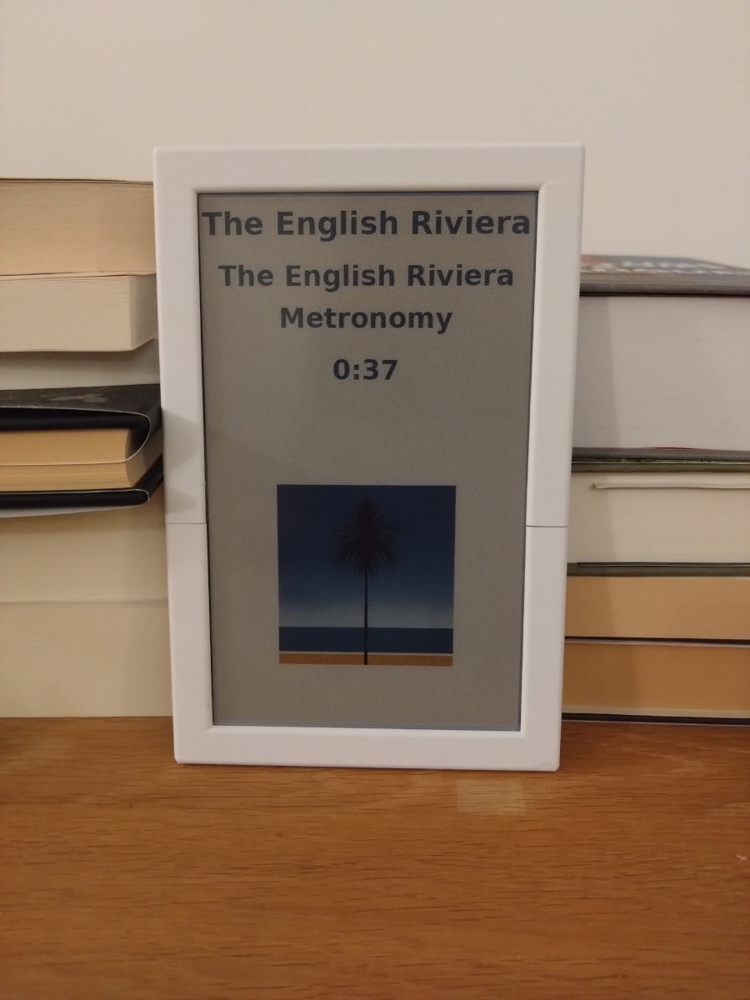
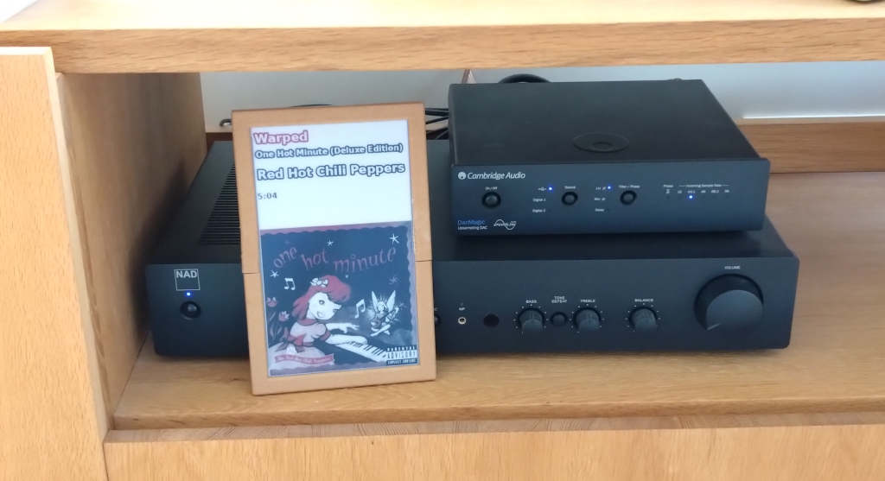
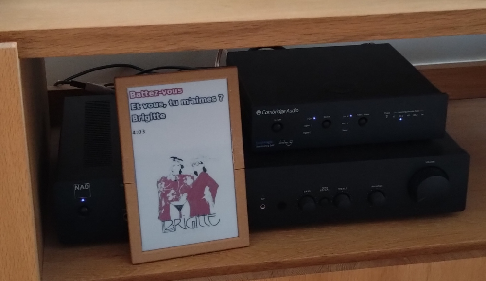
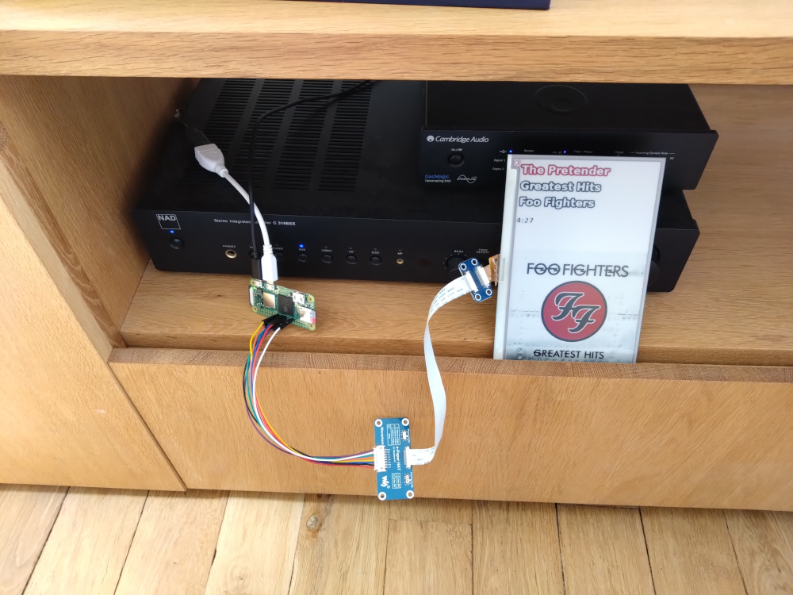

A very naive librespot event handler which displays now playing track information on a WaveShare EPD 7.3" Spectra 6 (E6) color epaper/eink screen

(Initial versions used an WaveShare EPD 7.5" red / black / white screen)

Uses:
 * librespot: https://github.com/librespot-org/librespot/ (requires dev branch / version 5.0 events)
 * omni-epd: https://github.com/robweber/omni-epd/
 * WaveShare 7.3inch E Ink Spectra 6 (E6) Full Color E-Paper Display: https://www.waveshare.com/7.3inch-e-paper-hat-e.htm

